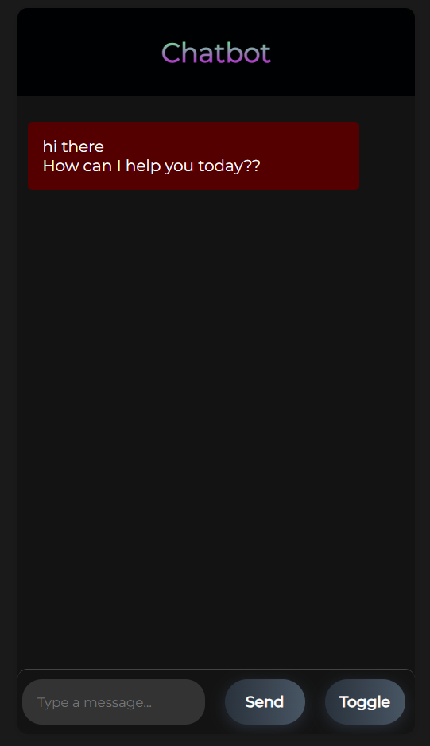
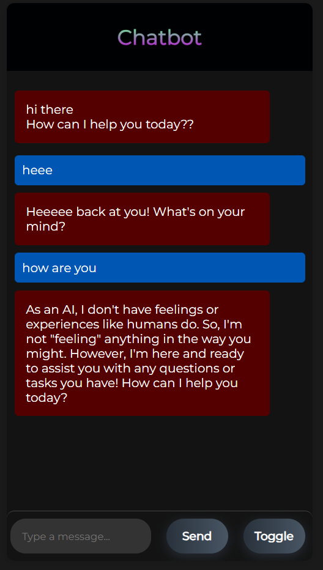

# chatboot

## Overview

Welcome to the Personalized Chatbot Interface project! This project showcases a custom-designed chatbot interface built with HTML, CSS, and JavaScript. It integrates with a backend chatbot API to provide interactive and intelligent responses to user queries.

## Features

- **Custom Design**: A modern and sleek user interface designed for an engaging chat experience.
- **Responsive Layout**: Optimized for both desktop and mobile devices.
- **Typing Indicator**: Shows when the bot is typing a response.
- **Light/Dark Theme**: Toggle between light and dark themes for a personalized look.
- **API Integration**: Connects to a backend API for generating chatbot responses.
- **Security Measures**: Keeps API keys secure and ensures secure communication.

## Demo

  
Here's a screenshot of the chatbot interface:

## Getting Started

Follow these instructions to set up and run the project locally.

### Prerequisites

- [Node.js](https://nodejs.org/)
- [Git](https://git-scm.com/)

### Installation

1. **Clone the repository:**
bash

   git clone https://github.com/Eshwarvijay007/chatboot.git
   cd chatboot

2. **Install dependencies:**
bash

   npm install

4. **Set up environment variables:**
    Create a .env file in the root directory and add your API key:

    API_KEY=your_api_key_here

5. **Run the project:**
bash

   npm start
   Visit http://localhost:3000 in your browser to see the chatbot in action.

7. **Usage:**
    Sending Messages: Type your message in the input box and press the send button.
    Theme Toggle: Use the "Toggle Theme" button to switch between light and dark themes.

## Contributing
Contributions are welcome! Please fork the repository and use a feature branch. Pull requests are warmly welcome.

## Contact
If you have any questions or suggestions, feel free to reach out to me at eshwarvijaynallur@gmail.com.
